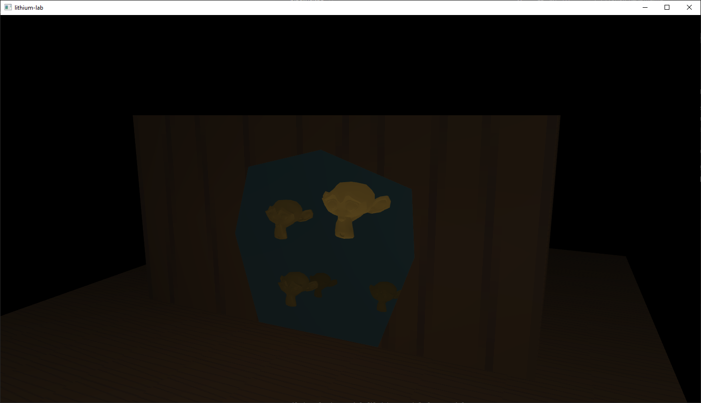

# Stencil testing to achieve an interior scene that is larger than the encapsulating exterior

In this application we render an interior scene that is larger than the exterior scene by using the OpenGL stencil buffer.

1. Write exterior object (shack) back faces to the stencil buffer
2. Clear the stencil buffer using the exterior object front faces
3. Render the interior scene where the stencil buffer is set (=1). This will be at the door opening.
5. Render the exterior scene where the stencil buffer is not set (=0).

The result looks like following.

