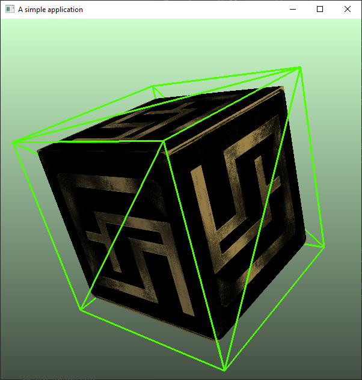

# lithium-app

This is an example application using the lithium game engine.



## Build
* This project uses [lithium](https://github.com/filipfur/lithium-app.git) game engine as a submodule dependency. Use ```git submodule update --init``` to pull the source.
## Recomended development environment
* Install Visual Studio with C++ build tools (MSVC compiler).
* Install Visual Studio Code and extensions for C++ and CMake.
* Use VS or Code to compile the source code using the top-level CMakeLists.txt.